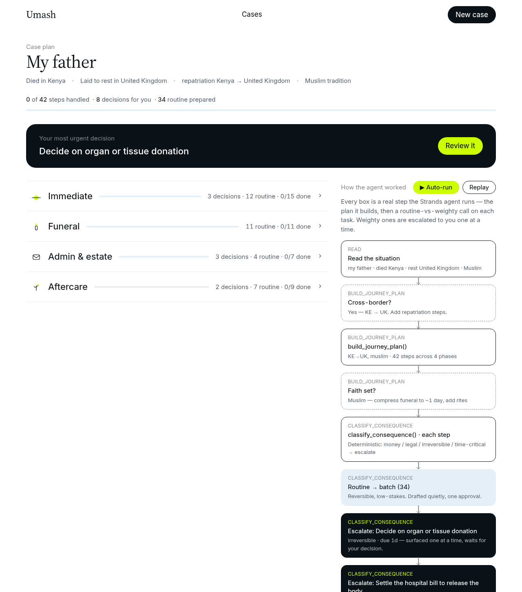
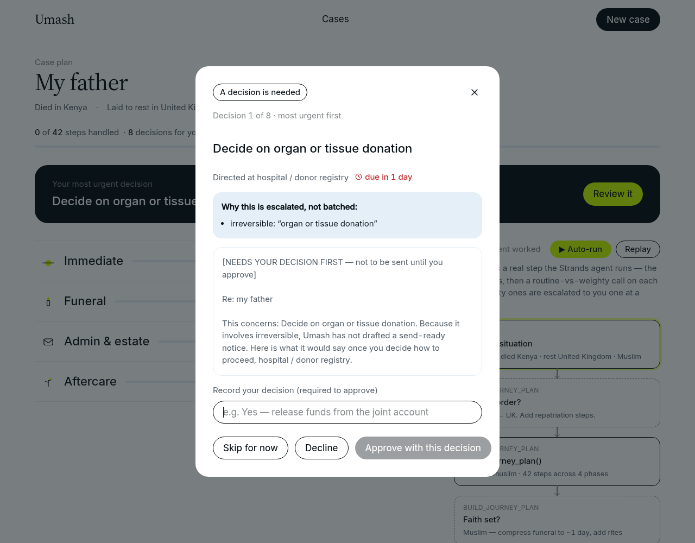

# Agents for Humans: keep the safety-critical logic out of the model

*How Umash, an aftermath coordinator for grieving families, puts the decisions that matter in plain Python the agent cannot override, built with the Strands Agents SDK on Amazon Bedrock.*

## The problem I was actually solving

When someone dies, the people left behind inherit a second job on the worst week of their life: register the death, choose a mortuary against its clock, settle a hospital bill before the body is released, arrange the funeral, then months of banks, insurers, benefits, and closing accounts. The steps differ by country. For families split across borders, repatriation adds a whole branch.

I wanted an agent that carries a family through that whole arc. But an agent that acts on your behalf during grief is exactly where "the AI did something unexpected" stops being a funny demo and becomes real harm. Settling a hospital bill, filing a benefit claim, agreeing to repatriate a body: these are irreversible, they cost money, and some are time-critical. You cannot let a language model decide, on its own phrasing, whether one of those needs a human.

So the design question wasn't "how capable can the agent be." It was "what must the model never be allowed to decide."

## The one rule

Umash runs on a single rule:

- **Routine, low-stakes, reversible** work (draft the registration letter, the employer notice, a subscription cancellation) is prepared quietly and **batched into one approval**.
- **Weighty** work (money leaving, a legal signature, anything irreversible or time-critical) is **escalated one at a time**, with the tradeoffs laid out, and is **never executed autonomously**.

The agent drafts, plans, and waits. It never files, pays, or books anything. Restraint is the entire product.

The interesting part is where that rule lives.

## The split: model for judgment, code for safety

Umash is one Strands agent on Amazon Bedrock. The agent is genuinely useful: it orders the journey, adapts its tone to a grieving reader, and decides what to say versus what to keep quiet. That is what language models are good at.

But whether a task is weighty is not the model's call. That decision lives in a deterministic policy layer, plain Python, no model, no network:

```
umash/policy/
  phases.py         # the four phases, in order
  jurisdictions.py  # KE / UK / US task packs as DATA + repatriation
  faith.py          # optional rites + burial-window urgency
  consequence.py    # ROUTINE vs WEIGHTY: the safety core
  casestate.py      # task lifecycle + the safety invariant
```

`consequence.py` classifies a task by matching narrow keyword sets, money, legal, irreversible, time-critical, benefit-claim. Any hit makes it weighty. Everything else is routine. It is deliberately boring code:

```python
def classify(task_text, deadline_days=None):
    t = (task_text or "").lower()
    weighty = _hit(_MONEY) or _hit(_LEGAL) or _hit(_IRREVERSIBLE) \
              or _hit(_TIME_CRITICAL) or _hit(_CLAIM)
    return Verdict(WEIGHTY if weighty else ROUTINE, ...)
```

A grieving person's need for a decision must not depend on how a model happened to phrase things this time. Determinism is the point. The same input always produces the same escalation.

## The invariant that makes it safe

Classification alone isn't enough. The stronger guarantee lives in the case state machine: **a weighty task cannot move to approved without a recorded human decision.** That is enforced in code, not left to the agent's good behavior:

```python
def approve(self, task_id, decision=""):
    t = self.get(task_id)
    if t.weighty and not (decision or t.decision):
        raise InvalidTransition(
            f"'{t.title}' is weighty and needs an explicit decision before approval")
    ...
```

There is no path, no prompt, no clever jailbreak, that approves a hospital-bill release without a human decision on the record. The model does not hold that capability, so it cannot give it away.

## Why this is also the security story

Every LLM can be prompt-injected. Umash reads free text about a death and drafts notices, so a malicious string could try to steer it. The usual reaction is to bolt on filters and hope.

Umash's real defense is architectural. Look at what the agent can actually do: six tools, `build_journey_plan`, `classify_phase`, `classify_consequence`, `draft_notice`, `schedule_followup`, `track_confirmation`. None of them file, pay, book, or send. The worst a fully hijacked model can do is produce a bad piece of text or a wrong plan. It cannot take a real-world action, because there is no tool that takes one, and it cannot reclassify a weighty task as routine, because that is not its decision.

That reframes the threat model. The blast radius of a successful injection is "an awkward draft," not "an account was drained." I added an Amazon Bedrock Guardrail on top (PII redaction of decedent data, a denied topic for professional advice, prompt-attack filtering) as defense-in-depth, but the guardrail is the second line. The architecture is the first.

## What the model still does, and why it's worth having

None of this makes the model decorative. Building the phased, jurisdiction-aware, faith-aware plan, ordering forty-odd tasks into a sane sequence, writing a registration notice that sounds human instead of like a form, deciding that a Muslim family's funeral needs to lead everything because the burial window is about a day, that is real work, and the agent does it well. The deterministic layer tells the agent what is safe. The agent decides what is kind.

## Making the split visible

A safety argument you can't see is easy to disbelieve. So the web dashboard shows
the plan on the left and, on the right, the agent's decision flow as boxes and
arrows — every box a real step it runs through its tools.



You can read the whole rule off the picture. `build_journey_plan` takes the
cross-border branch (Kenya to the UK, so add repatriation) and the faith branch
(Muslim, so compress the funeral to about a day). Then `classify_consequence`
runs on every task and forks: thirty-four routine tasks collapse into a single
"batch" node, and each weighty task becomes its own escalation — organ donation,
settling the hospital bill to release the body, repatriate versus bury.

Hit auto-run and the whole journey plays hands-off in about three minutes. The
routine work batches silently; each weighty decision opens for review, waits,
records the decision, and closes so the flow moves on.



Notice the draft: for a weighty task Umash deliberately does *not* produce a
send-ready notice. It says, in plain words, that this needs the human's decision
first. The routine drafts are ready to send; the weighty ones are not, by design.

## The payoff for a builder

Splitting judgment from safety gave me things I did not expect:

- **The core runs with zero third-party dependencies and no AWS credentials.** Because the policy layer is plain Python, the whole product, phased plan, batch-vs-escalate, persistence, runs offline. That is what CI exercises and what a reviewer can try in seconds.
- **Coverage grows by editing data, not the agent.** Adding a country is a new task pack. Adding a tradition is a new faith pack. The agent never changes.
- **The web UI mirrors the exact same logic** in the browser, so the product demo needs no backend and no model call, yet it enforces the identical safety invariant.

If you are building an agent that acts in a domain where mistakes are expensive, the lesson generalizes: **make the model's job smaller and clearer, not bigger.** Give it no tool that can cause the harm you are worried about, and put the decision of "does a human need to see this" in code you can read, test, and trust. The agent is better for having less power, and so is everyone who depends on it.

---

*Umash was built for the Agents for Humans hackathon with the Strands Agents SDK on Amazon Bedrock, deployable to Amazon Bedrock AgentCore. Source: github.com/lewisawe/umash.*
